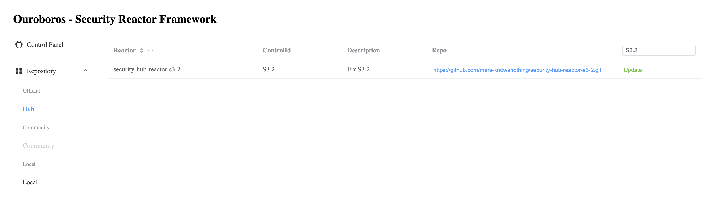

# Overview / 项目概述
项目采用无服务器架构实现基于Security Hub的安全事件响应框架

## Online Demo
[Ouroboros Reactor](http://serverless-for-good-final.s3-website-ap-southeast-1.amazonaws.com/)
# Architecture / 架构图


## Components
### Frontend
Ouroboros Frontend is built with VUE3 + Nuxt3 + Element-Plus and deployed with Amazon S3 Static Web Hosting.

项目前端使用了VUE3 + Nuxt3 + Element-Plus 开发, 使用AWS S3静态网站发布功能进行部署

### API - Lambda Function
* **ouroboros_ims_service_security_hub**
* **ouroboros_ims_service_security_hub_controls**
* **ouroboros_ims_service_security_hub_findings**

Handle requests from API gateway, query schedule rules and logs in dynamodb and response

应用后端使用API Gateway + Lambda 开发, 负责处理来自前端的REST API请求, 查询DynamodDB中的数据并返回响应结果, 对于非只读类的接口采用API KEY 进行认证

### Time-based Backend Jobs - Lambda Function

* **ouroboros_ims_collector_security_hub**

Triggered with time-based event, collect enabled standards, controls of standards in to dynamodb

由event bridge定时事件触发，用于收集Master账号中启用的安全标准和对应的控制项

* **ouroboros_ims_collector_security_hub_findings**

Triggered with time-based event, collect findings in managed accounts to dynamodb

由event bridge定时事件触发，用于收集所有账号中产生后集中到管理账号的findings

### Database - DynamoDB (Consumer)

* **cmdb_dev_security_controls**
* **cmdb_dev_security_findings**
* **cmdb_dev_security_local_reactors**

Tables to store standards, controls, findings, reactors(installed).

DynamoDB表, 用于存储启用的标准，控制项，检查结果以及已经安装的安全事件响应程序

* **cmdb_dev_sfn_statemachines**

Table to store reactor execution history.

### Database - DynamoDB (Hub)

* **cmdb_dev_security_controls**
* **cmdb_dev_security_reactors**

Tables to store standards, controls, reactors(repository).

DynamoDB表, 用于存储启用的标准，控制项，以及供Consumer安装的安全事件响应程序

### Streaming Service - DynamoDB Stream (Consumer)
**cmdb_dev_security_local_reactors/stream**

Event stream capture both INSERT and REMOVE operations in *cmdb_dev_security_local_reactors* and trigger installation/uninstallation pipelines

使用了DynamoDB的Stream功能, 自动捕获数据库中Reactor对象的变化, 触发Reactor Lambda函数的部署或清理流水线

### Streaming Service - DynamoDB Stream (Hub)
**cmdb_dev_security_reactors/stream**

Event stream capture both INSERT and REMOVE operations in *cmdb_dev_security_local_reactors* and trigger installation/verification pipelines

使用了DynamoDB的Stream功能, 自动捕获数据库中Reactor对象的变化, 触发Reactor Lambda函数的部署或测试流水线

### Security Reactor Workflow - Step Function

* **security_hub_finding_reactor**

Definition

```
{
  "Comment": "A description of my state machine",
  "StartAt": "Parse Security Hub Finding",
  "States": {
    "Parse Security Hub Finding": {
      "Type": "Task",
      "Resource": "arn:aws:states:::lambda:invoke",
      "OutputPath": "$.Payload",
      "Parameters": {
        "Payload": {
          "findings.$": "$.detail.findings"
        },
        "FunctionName": "arn:aws:lambda:ap-southeast-1:592336536196:function:ouroboros_ims_step_parse_finding:$LATEST"
      },
      "Retry": [
        {
          "ErrorEquals": [
            "Lambda.ServiceException",
            "Lambda.AWSLambdaException",
            "Lambda.SdkClientException"
          ],
          "IntervalSeconds": 2,
          "MaxAttempts": 6,
          "BackoffRate": 2
        }
      ],
      "Next": "Process Findings"
    },
    "Process Findings": {
      "Type": "Map",
      "Iterator": {
        "StartAt": "Execute Security Hub Finding Reactor",
        "States": {
          "Execute Security Hub Finding Reactor": {
            "Type": "Task",
            "Resource": "arn:aws:states:::lambda:invoke",
            "OutputPath": "$.Payload",
            "Parameters": {
              "Payload.$": "$",
              "FunctionName": "arn:aws:lambda:ap-southeast-1:592336536196:function:ouroboros_ims_step_dispatch_finding:$LATEST"
            },
            "Retry": [
              {
                "ErrorEquals": [
                  "Lambda.ServiceException",
                  "Lambda.AWSLambdaException",
                  "Lambda.SdkClientException"
                ],
                "IntervalSeconds": 2,
                "MaxAttempts": 6,
                "BackoffRate": 2
              }
            ],
            "Next": "Send Notification"
          },
          "Send Notification": {
            "Type": "Task",
            "Resource": "arn:aws:states:::lambda:invoke",
            "OutputPath": "$.Payload",
            "Parameters": {
              "Payload": {
                "messages.$": "$.result.messages"
              },
              "FunctionName": "arn:aws:lambda:ap-southeast-1:592336536196:function:ouroboros_ims_step_send_notification:$LATEST"
            },
            "Retry": [
              {
                "ErrorEquals": [
                  "Lambda.ServiceException",
                  "Lambda.AWSLambdaException",
                  "Lambda.SdkClientException"
                ],
                "IntervalSeconds": 2,
                "MaxAttempts": 6,
                "BackoffRate": 2
              }
            ],
            "End": true
          }
        }
      },
      "End": true
    }
  }
}
```
Diagram


Receive security hub finding-imoported events from event bridge, query dynamodb for reactor configuraton and parse item into individual params for each finding, then execute corresponding reactor lambda function to fix and notify via wechat@work.

Lambda Functions
1. ouroboros_ims_step_parse_finding
2. ouroboros_ims_step_dispatch_finding
3. ouroboros_ims_step_send_notification

主要执行了以下操作:

1. 以Event bridge作为事件源, 捕获所有Findings-Imported 类型的 Security hub事件
2. 查询实践中控制类型所配置的并将事件转化为执行Reactor Lambda, 并将事件转化为执行Reactor Lambda所需要的参数
3. 执行Reactor Lambda并记录结果
4. 发送通知到企业微信

### Notification Service
**ouroboros_sns_topic_notification**

SNS topic for integration with wechat@work REST API

用于和企业微信或其他即时通信工具的REST API进行集成, 进行事件通知

### Sample Reactor
* **aws-foundational-security-best-practices-v-1_0_0-S3_2-fix**

Fix finding generated for S3.2 of 
[AWS Foundational Security Best Practices V1.0.0](https://docs.aws.amazon.com/securityhub/latest/userguide/securityhub-standards-fsbp.html)


S3.2 - "S3 buckets should prohibit public read access"

针对AWS Foundational Security Best Practices V1.0.0中 S3.2的修复, 删除允许公网访问所有object的S3 policy statement.


# Features / 功能

### Security findings view with filter, sort and search


### Security controls view  with filter, sort and search


### Search and install reactors from Official Hub




### Select installed reactor for specific security control


### Event driven automatic finding remediation for configured control


### Trigger finding remediation manually


### Manage installed reactors


### Cross account remediation support

* Support reactor with sufficient permission can remediate findings in remote accounts via STS.

# Business Value

### Designed for Enterprise Customers

* Designed for multi-tenant architecture and large-scale cloud infrasture management.

* 为多租户场景和大规模云上基础设施管理而设计，适合企业级用户

* Help enterprise customer to build up continuious security & compliance system in a cost-efficient way.

* 在当前数据安全越来越受重视, 规范和监管越来越严格的挑战下, 帮助企业用户构建自己的自动化持续安全合规体系

### Designed for DevSecOps

* It's a proactive approach to cybersecurity where secure practices are embedded into the entire lifecycle of software development.

* 面向DevSecOps设计, 可以方便地通过API与已客户已有的DevOps工具链集成, 实现将安全合规内嵌入整个IT生命周期

### Designed for builders and leverage the power of builders

* "Builders are people who like to invent, who look at different customer experiences and try to figure out how to reinvent them. We’re all builders because companywide, we’re all working together to help our customers grow and thrive."

* 面向广大Builders设计, 拥抱开源社区文化, 共同构建强壮的解决方案